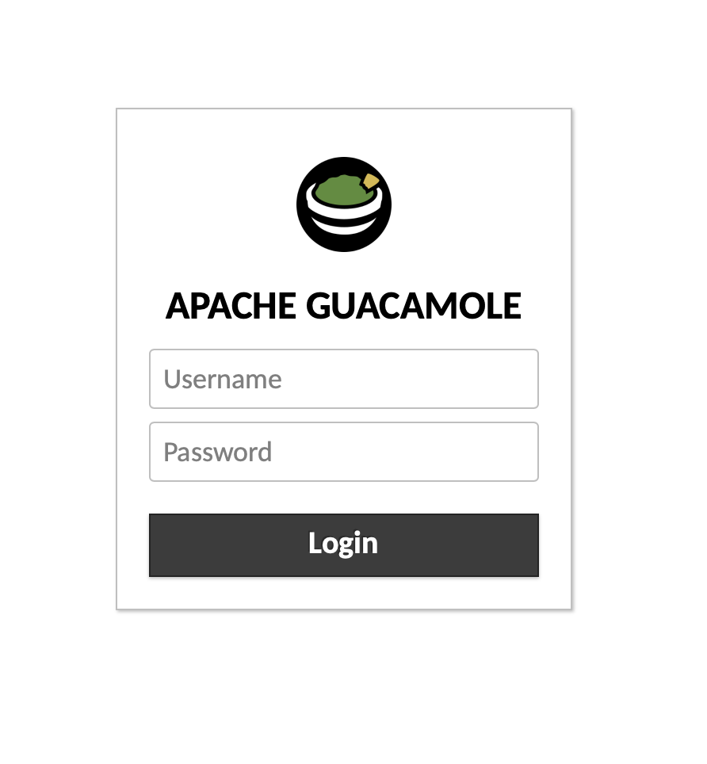
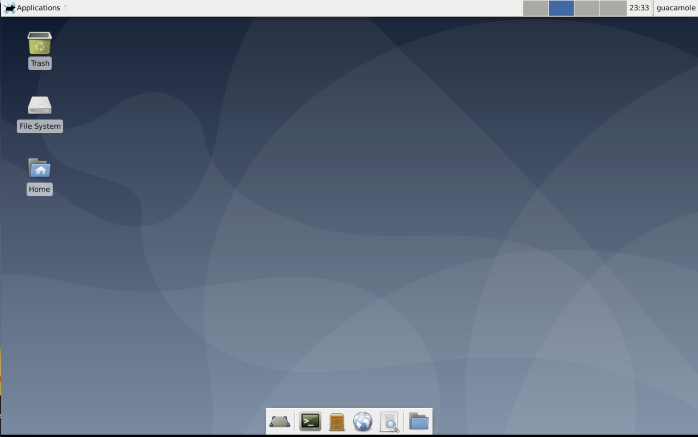

## Guacamole Marketplace App

Apache Guacamole is an open source HTML5 based web application used as a clientless remote desktop gateway. With Guacamole's Marketplace App, you'll be able to access a graphical VNC session using the XFCE destop environment. This application enables the creation of a Linode using a unique user name and password defined by you as part of the App creation process, complete with an SSL certificate generated by let's encrypt on your own personal domain.

### Deploy a Guacamole Marketplace App



The [Guacamole Options](#guacamole-options) section of this guide provides details on all available configuration options for this app.

### Guacamole Options

You can configure your Guacamole App by providing values for the following fields:

| **Field** | **Description** |
|:--------------|:------------|
| **The limited sudo/VNC user to be created for the Linode** | The VNC username created for this Linode with sudo permissions. This will be used for your VNC session. *Required*. |
| **The password for the limited sudo/VNC user** | Password for your sudo/VNC user. This will be used for your VNC session. *Required*. |
| **The username to be used with Guacamole** | Your Guacamole Username. This will be used to login to Guacamole. *Required*. |
| **The password to be used with Guacamole** | Your Guacamole Password. This will be used to login to Guacamole. *Required* |
| **Your Linode API Token** | Your Linode `API Token` is needed to create DNS records. If this is provided along with the `subdomain` and `domain` fields, the installation will attempt to create DNS records via the Linode API. If you don't have a token, but you want the installation to create DNS records, you must [create a token](/docs/platform/api/getting-started-with-the-linode-api/#get-an-access-token) to use in this field before continuing. |
| **Subdomain** | The subdomain you wish the installer to create a DNS record for during setup. The suggestion given is `www`. The subdomain can only be created if you also provide a `domain` and `API Token`. |
| **Domain** | The domain name where you wish to host your Webmin server. The installer creates a DNS record for this domain during setup if you provide this field along with the required `API Token`. |

### Linode Options

After providing the app specific options, provide configurations for your Linode server:

| **Configuration** | **Description** |
|:--------------|:------------|
| **Select an Image** | Debian 10 is currently the only image supported by the Guacamole Marketplace App, and it is pre-selected on the Linode creation page. *Required*. |
| **Region** | The region where you would like your Linode to reside. In general, it's best to choose a location that's closest to you. For more information on choosing a DC, review the [How to Choose a Data Center](/docs/platform/how-to-choose-a-data-center) guide. You can also generate [MTR reports](/docs/networking/diagnostics/diagnosing-network-issues-with-mtr/) for a deeper look at the network routes between you and each of our data centers. *Required*. |
| **Linode Plan** | Your Linode's [hardware resources](/docs/platform/how-to-choose-a-linode-plan/#hardware-resource-definitions). Guacamole can be supported on any size Linode, but we suggest you deploy your Guacamole app on a Linode plan that reflects how you plan on using it. If you decide that you need more or fewer hardware resources after you deploy your app, you can always [resize your Linode](/docs/platform/disk-images/resizing-a-linode/) to a different plan. *Required*. |
| **Linode Label** | The name for your Linode, which must be unique between all of the Linodes on your account. This name will be how you identify your server in the Cloud Manager’s Dashboard. *Required*. |
| **Root Password** | The primary administrative password for your Linode instance. This password must be provided when you log in to your Linode via SSH. The password must meet the complexity strength validation requirements for a strong password. Your root password can be used to perform any action on your server, so make it long, complex, and unique. *Required*. |

When you've provided all required Linode Options, click on the **Create** button. **Your Guacamole app will complete installation anywhere between 2-5 minutes after your Linode has finished provisioning**.

## Getting Started after Deployment

### Access your Guacamole App

After Guacamole has finished installing, you will be able to access your Drupal site over `http://` or `https://` with your Linode's IPv4 address depending on how .

1. If you set up a domain name as part of the script, skip to step 4.  If you didn't set up a domain name, find your Linode's IPv4 address and click on the **Linodes** link in the Cloud Manager sidebar. You will see a list of all your Linodes.

1. Find the Linode you just created. Under the **IP Address** column, copy the IPv4 address.

1. Navigate to the **Networking** tab.

1. Enter your Linode's domain, subdomain, or IPv4 address into a browser window, for example, `http://192.0.2.0`. You will be brought to the Guacamole login page. Enter your Guacamole username and password,

    

1. Once you've completed the login process, you will have full access to a graphical desktop environment using VNC and the XFCE desktop environment. Additional tasks can be performed remotely through your web browser.

     

### Software Included

The Guacamole Marketplace App will install the following required software on your Linode:

| **Software** | **Description** |
|:--------------|:------------|
| [**MariaDB Server**](https://mariadb.org/) | Relational database. |
| [**PHP 7**](https://www.php.net) | Drupal is written in PHP and requires PHP to operate. |
| [**Apache HTTP Server**](https://httpd.apache.org) | Web Server used to serve the Drupal site. |
| [**Drupal 9**](https://www.drupal.org/about/9) | Content management system. |

